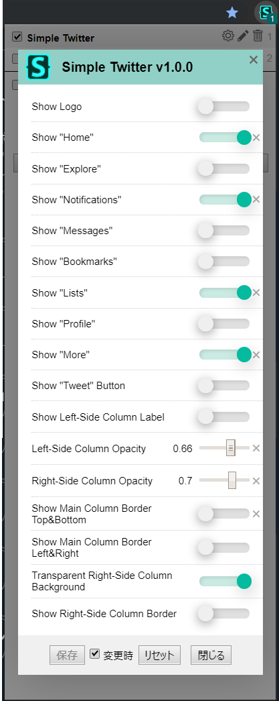

# twitter-simplify

The UserStyle to simplify [twitter.com](https://twitter.com).

## Prerequests

The [stylus](https://github.com/openstyles/stylus#releases) should be installed to your browser.

## Installation

Click [here](https://github.com/acomagu/twitter-simplify/raw/master/simple-twitter.user.css).

## Configurations

